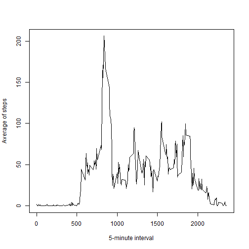

# Reproducible Research: Peer Assessment 1

***

This assignment makes use of data from a personal activity monitoring device. This device collects data at 5 minute intervals through out the day. The data consists of two months of data from an anonymous individual collected during the months of October and November, 2012 and include the number of steps taken in 5 minute intervals each day.  

This assignment is written in a single R markdown document that can be processed by knitr and be transformed into an HTML file.

***

## Loading and preprocessing the data  

The file is already downloaded, unziped and saved in working directory.  

1. The data is loaded using the <span style="color:red">`read.csv()`</span>, the date is formated in YYYY-MM-DD format.


```r
wd <- "C:/Users/Administrator/Desktop/Data_Science/Reproducible/RepData_PeerAssessment1"
setwd(wd)

ActivityData <- read.csv("activity.csv")
ActivityData$date <- as.Date(ActivityData$date,"%Y-%m-%d")
```

2. View first rows of data with <span style="color:red">`head()`</span> function.


```r
head(ActivityData)
```

```
##   steps       date interval
## 1    NA 2012-10-01        0
## 2    NA 2012-10-01        5
## 3    NA 2012-10-01       10
## 4    NA 2012-10-01       15
## 5    NA 2012-10-01       20
## 6    NA 2012-10-01       25
```

## What is mean total number of steps taken per day?

1. Calculate the sum and mean of steps per day and per interval with <span style="color:red">`aggregate()`</span> function (the missing values are ignored).


```r
steps_per_day <- aggregate(steps ~ date, data = ActivityData, sum ,na.rm = TRUE)
```

2. Histogram of the total number of steps take each day:

```r
hist(steps_per_day$steps, 20, main = "Histogram of Steps per day", xlab = "Steps", ylab = "Frequency")
```


3. Mean of the total number of steps take each day using <span style="color:red">`mean()`</span> function

```r
mean(steps_per_day$steps)
```

```
## [1] 10766.19
```

4. Median of the total number of steps take each day using <span style="color:red">`median()`</span> function

```r
median(steps_per_day$steps)
```

```
## [1] 10765
```


## What is the average daily activity pattern?

1. Make a time series plot (i.e. type = "l") of the 5-minute interval (x-axis) and the average number of steps taken, averaged across all days (y-axis)


```r
steps_per_interval <- aggregate(steps ~ interval, data = ActivityData, mean, na.rm = TRUE)
plot(steps~interval,data=steps_per_interval,type="l", xlab="5-minute interval", ylab="Average of steps")
```



2. Find the maximum steps on average across all the days using <span style="color:red">`which.max()`</span>


```r
steps_per_interval[which.max(steps_per_interval$steps),]
```

```
##     interval    steps
## 104      835 206.1698
```

*So, the interval with the maximum average number of steps in the days is 835 with 206.1698 steps.*

## Imputing missing values

1. Calculate the number of missing values in the dataset (rows with NAs)

```r
missing <- !complete.cases(ActivityData)
sum(missing == TRUE)
```

```
## [1] 2304
```

2. Fill the missing values with the average number of steps in the same 5-min interval


```r
MissActivityData <- ActivityData[missing == TRUE,]
MissActivityData[,1] <- steps_per_interval$step
```

3. Create a new dataset that is equal to the original dataset but with the missing data filled in

```r
ActivityDataFilled <- rbind(ActivityData[complete.cases(ActivityData),], MissActivityData)
```

4. Make a histogram of the total number of steps taken each day and Calculate and report the mean and median total number of steps taken per day. Do these values differ from the estimates from the first part of the assignment? What is the impact of imputing missing data on the estimates of the total daily number of steps?

```r
steps_per_day_fill <- aggregate(steps ~ date, data = ActivityDataFilled, sum)
hist(steps_per_day_fill$steps, 20, main="Histogram of Steps per day, including missing values", xlab = "Steps per day", ylab = "Frequency")
```


Mean of the total number of steps with the filled in values

```r
mean(steps_per_day_fill$steps)
```

```
## [1] 10766.19
```

Median of the total number of steps with the filled in values

```r
median(steps_per_day_fill$steps)
```

```
## [1] 10766.19
```

*The impact of inputting missing data is minimal, the median is equal to mean.*

## Are there differences in activity patterns between weekdays and weekends?

1. Create a new factor variable in the dataset with two levels - "weekday" and "weekend" indicating whether a given date is a weekday or weekend day, using <span style="color:red">`weekdays()`</span> function.


```r
weekdays <- weekdays(ActivityDataFilled$date)
ActivityDataFilled$weekdays <- ifelse(weekdays == "Sunday" | weekdays == "Saturday","Weekend", "Weekday")

steps_per_week <- aggregate(ActivityDataFilled$steps, by=list(ActivityDataFilled$interval,ActivityDataFilled$weekdays),mean)

names(steps_per_week) <- c("interval","weekdays","steps")
```

2. Make a panel plot containing a time series plot (i.e. type = "l") of the 5-minute interval (x-axis) and the average number of steps taken, averaged across all weekday days or weekend days (y-axis).


```r
library(lattice)
xyplot(steps ~ interval | weekdays, steps_per_week, type="l",layout=c(1,2), xlab="Interval", ylab = "Number of steps", main="Activity Patterns on Weekends and Weekdays", col = "blue")
```


*Comparing the two plots results that the activity is greater earlier in the day during weekdays compared to weekends, but in the rest of the day is more active in weekends compared with weekdays.*

